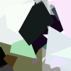
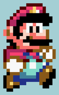
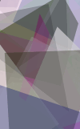
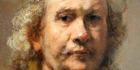
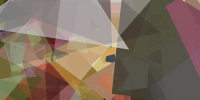
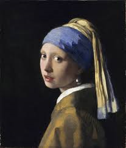

# Genetic Algorithm Image

## Overview

This project uses genetic algorithm, evolving an image to reproduce another reference image.

After starting with a simplified version, reproducing binary images composed of black shapes on white background to make sure the population actually improved and converged, I've been able to switch to this more complex version, using
real world pictures and illustrations.

The algorithm uses Canvas API to draw random colored shapes on a starting white background, and iteratively tries to reduce the difference between its generated pictures and the reference picture it's been given to reproduce.

## Algorithm Details

### Genes

Each gene is a **random colored cyclic quad**, representing a **stroke**.

For performance reasons, each stroke is drawn on a separate canvas and stored in the file system, then used as a PNG image to be drawn on the generated image's canvas.

Strokes are **random colored cyclic quads** : we place a circle's center on a random $(x,y)$ position inside the canvas' limits, then 4 points are randomly placed on the circle's edge, and finally a random color is assigned to the shape.

### Individuals

Individuals represent an evolving picture, trying to reproduce the reference picture.

Each individual is composed as a list of **stroke indice** that will be drawn when converting the individual **genotype** to its canvas **phenotype**.

When mutation occur, we simply replace the mutating gene by another index taken randomly from the stroke indice list.

### Population

#### Fitness function

We simply use the **sum of squared errors** to compute the individuals fitnesses :

$$
J = \sum_{i=1}^n{(\vec{y_i}-\vec{x_i})^2}
$$

Where $\vec{x}$ is the generated RGB color for a given pixel and $\vec{y}$ the actual RGB color for the same pixel in the reference image.

#### Selection

We use **roulette wheel selection** to pick the individuals that will be used for mating, with a probability of being picked proportionnal to their respective fitness.

#### Cross Over

After choosing two individuals for mating, we create their offspring by randomly picking a **pivot** index.

- Child $A$ gets genes $[0..p[$ from parent $A$ and $[p..n]$ from parent $B$
- Child $B$ gets genes $[0..p[$ from parent $B$ and $[p..n]$ from parent $A$

#### Culling

We evaluate the offsprings fitnesses, then we place parents and offspring in an array, sorted according to the individuals fitnesses.

We only keep the $n$ best individuals to make the population size constant, and ensure no regression can occur with elitism, achieved by the overall sorting operation.

### Working by steps

Like in a real world painting, we'll proceed by **steps** to reproduce the reference image.

Up to now in this project state, a step is defined by a number of generations to evolve for one population, and a size for the circles defining the strokes.

Further we go in time, smaller are the strokes, to mimic the action of going from blocking large shapes on a canvas, and going more and more precisely to the details.

The result of each step is stored in file system, and **used as the background for the next step**.

## Current results

### Black and white picture

Reference Image | Evolution | 
:--------------:|:--------------:|
 | 

### Rasterized image (using pixel art)

Reference Image | Evolution | 
:--------------:|:--------------:|
 | 

### Old Masters paintings

Reference Image | Evolution | 
:--------------:|:--------------:|
 | 

Reference Image | Evolution | 
:--------------:|:--------------:|
 | 

## Review

### Resemblance results

#### Composition

**Shapes** are accurate, but the algorithm struggles to refine the **details**.

##### Possible improvements :

- Use an edge detection algorithm after a certain number of steps have been reached, to concentrate the little strokes on edges

- Find the blocky shape in the picture and stop exploring them once they match the reference overall color (no improvement by adding a 5\*5px cyan stroke in a 50\*50px cyan area)

#### Color

**Values** are overally well balanced, **hues** are generally quite close to the target, but the generated images lack **saturation**, compared to the reference images, and are more greyish than the target.

The lack of saturation is certainly due to the fact that the strokes use the **alpha channel** with a random value between 0 and 1.

This means that the final color of a pixel results from the addition of the strokes colors covering that pixel,with respect to their alpha value.

##### Possible improvements

- After a step has been completed, make more intense use of **exploitation**, placing the shape randomly, but using the average color of the area it covers and tuning its hue/value/saturation instead of creating a completely new random color.

### Technical results

#### Execution time

This is the main problem I've been facing : the algorithm is very slow.

Currently it can only reproduce images under 200\*200px size in a reasonable amount of time (meaning between 20 minutes to one hour, depending on the meta data)

Significative improvements have been met when precomputing the strokes as individual PNG files, and storing them in an array.

Firstly the canvas API saved time avoiding to recompute the same strokes several time for each generation, secondly I was able to cache the individuals' fitnesses.

##### Possible improvements

- Using the *WebGL* context instead of *context2D* of the canvas API for all the methods involving drawing
- Dynamically stop the evolution of a step after a threshold of low improvement between two generations is reached
- Scale the individuals and population's sizes relatively to the strokes sizes
- Using *worker_threads* or spawning child processes to evolve different parts of the image simultaneously and independently form each others

## Development

### Requirements

`node` and `npm` (used respectively v18.13.0 and 8.19.3)

### Scripts

`npm install` to install all the node modules locally.

#### Compile

`npm run compile` to transpile the TypeScript code source. The transpiled code will be stored in the `dist` folder

#### Run

- Place a PNG file in the `output` folder and name it `ref.png`
- Feel free to update the `app.config.json` parameters
- `npm run geneticImage` to execute the program
- Generated images for each step will be stored in the output folder, in the `results` subfolder